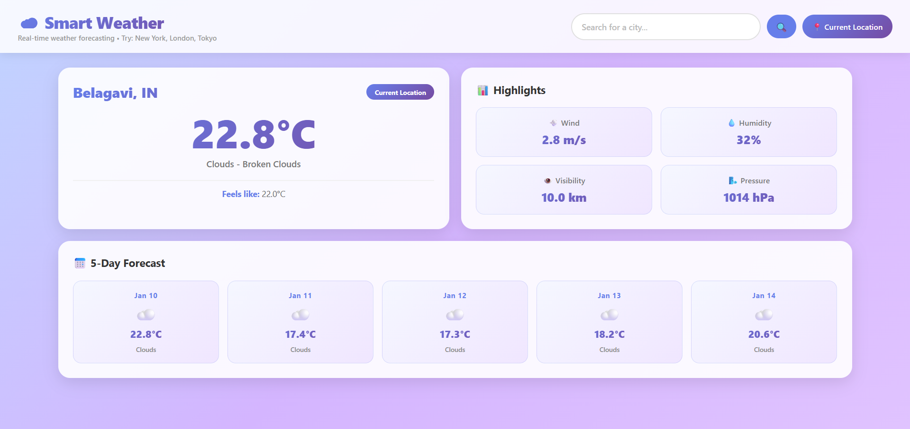

# Smart Weather 🌦️

A beautiful, real-time weather forecasting web application built with vanilla JavaScript, HTML, and CSS.

## Screenshots




## Features

✨ **Real-time Weather Data** - Get current weather conditions instantly
📍 **Location-Based Forecast** - Auto-detect your location or search any city
📊 **Detailed Highlights** - Wind speed, humidity, visibility, and pressure
📅 **5-Day Forecast** - Plan ahead with a 5-day weather outlook
🎨 **Beautiful UI** - Modern glassmorphism design with smooth animations
📱 **Responsive Design** - Works perfectly on desktop, tablet, and mobile

## Getting Started

### Prerequisites
- A modern web browser (Chrome, Firefox, Safari, Edge)
- Internet connection

### Installation

1. Clone the repository:
```bash
git clone https://github.com/yourusername/WindVision.git
cd WindVision
```

2. Open `index.html` in your browser using Live Server or by double-clicking the file

## How to Use

1. **Search for a City** - Type a city name and press Enter or click 🔍
2. **Use Current Location** - Click "📍 Current Location" button
3. **View Weather** - See current conditions and 5-day forecast

## Project Structure

```
WindVision/
├── index.html          # Main HTML file
├── style.css           # Styling and layout
├── script.js           # JavaScript functionality
├── .gitignore          # Git ignore file
└── README.md           # This file
```

## API Key Information

This project uses the **OpenWeatherMap API** for weather data.

✅ **The included API key is safe to upload** - it's a demo key for educational purposes.

To use your own API key:
1. Get a free key from [OpenWeatherMap](https://openweathermap.org/api)
2. Replace in `script.js`: `const API_KEY = "your-key-here";`

## Technology Stack

- **HTML5** - Structure
- **CSS3** - Styling with gradients and animations
- **JavaScript (ES6+)** - Functionality
- **OpenWeatherMap API** - Weather data

## Browser Support

- ✅ Chrome (latest)
- ✅ Firefox (latest)
- ✅ Safari (latest)
- ✅ Edge (latest)

## Key Features

### Current Weather Display
- Large city name
- Current temperature with gradient
- Weather condition
- Feels-like temperature

### Weather Highlights
- 💨 Wind Speed
- 💧 Humidity
- 👁️ Visibility
- 🌬️ Pressure

### 5-Day Forecast
- Weather icons
- Daily temperatures
- Condition descriptions

## Performance

- Pure vanilla JavaScript (no frameworks)
- Lightweight and fast
- Efficient API usage
- Error handling throughout

## Privacy & Permissions

- Location permission only requested on button click
- No data storage on your device
- HTTPS recommended for production


## Contributing

Contributions welcome! Open an issue or submit a pull request.

---

**Made with ❤️ for weather enthusiasts**

